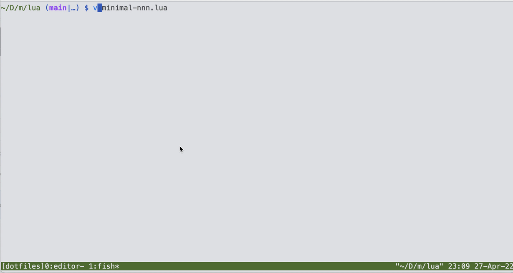

## minimal-nnn.nvim

The most minimal [nnn](https://github.com/jarun/nnn) plugin for neovim ever



### Install
```lua

    -- in your packer config
    use({"bobrown101/minimal-nnn.nvim"})

    -- tied to a keymap of your choice
    require("minimal-nnn").start()

```

## Description
Made possible by nvim --remote, we start up an nnn picker in a standard neovim terminal, and "callback" the result to the current neovim instance.
